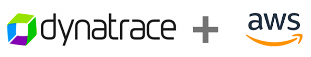

# Overview

The repo contains the setup and learner scripts to support [this AWS and Dynatrace workshop](http://aws-modernize-workshop.alliances.dynatracelabs.com/).

 

# Repo Structure

1. `provision-scripts/` - Scripts related to installing any prerequisite software
1. `app-scripts/` - Scripts related to installing workshop sample applications.
1. `workshop-config/` -Scripts related to the setup of the Dynatrace configuration for the learners Dynatrace tenant.
1. `learner-scripts/` - Scripts that get copied for learner to use in workshop labs.

See the README files in the subfolders for additional details.

# Feedback

Whether it's a bug report, new feature, correction, or additional documentation, we greatly value feedback and contributions.

You can share your feedback by opening a new issue [here](https://github.com/dt-alliances-workshops/aws-modernization-dt-orders-setup/issues).

Please ensure we have all the necessary information to effectively respond to your bug report or contribution such as:
* The URL to the page, file or script with an issue
* A reproducible test case or series of steps

# Maintainer

[Rob Jahn](https://www.linkedin.com/in/robjahn/) -- Email me @ rob.jahn@dynatrace.com with questions or more details.

# Tags

For meaningful changes to the scripts, git tags should be used.  Here is quick guide on tags.

```
# list tags with descriptions
git tag -n

# add tag
git tag -a [tagname] -m "description"
git push origin [tagname]

# checkout a tag
git checkout [tagname]

# checkout back to main branch
git checkout main
```